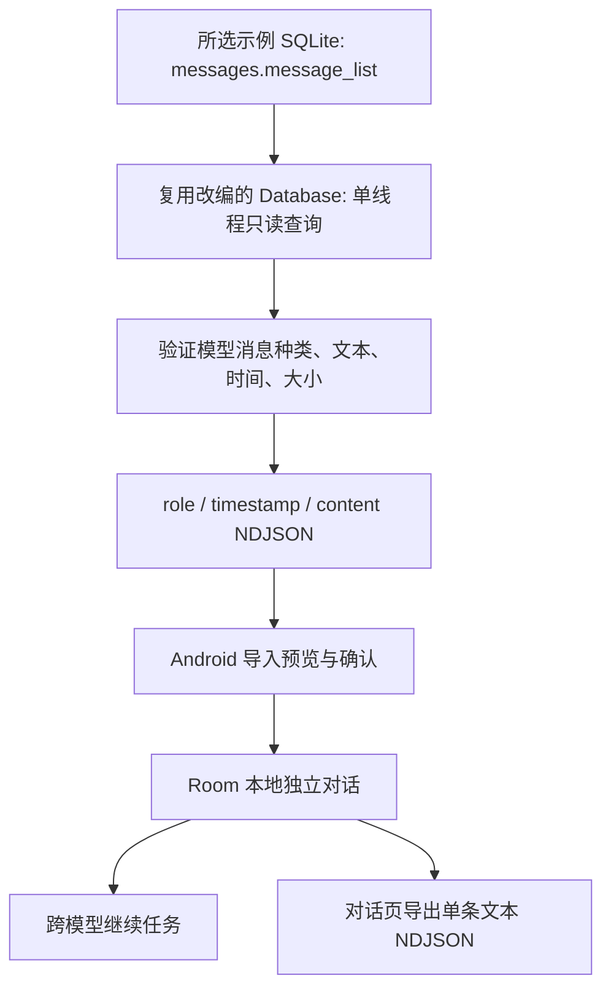
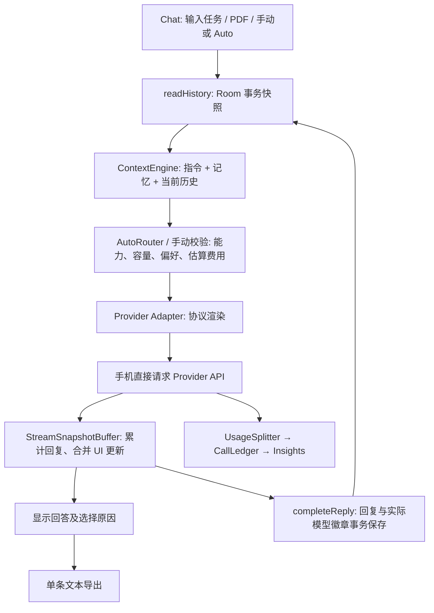

# ModelPilot — Open-source reuse, integration and added features

技术说明与阶段证据，2026-10-09。对应老师的 12 项要求；供后续 alpha/beta 技术报告与 PPT 引用。本文件补充技术细节，不改变现有 Outline/PDF 的排版。

## 1. Selected project: main features and code modules

**Chosen source component: Pydantic AI Chat App with FastAPI example**。项目仓库：https://github.com/pydantic/pydantic-ai；示例文档：https://ai.pydantic.dev/examples/chat-app/。

固定上游提交：`36529f3a8ebc5a5675129fe6262223b9da0815ec`。本地原版：[chat_app.py](../third_party/pydantic-ai-chat/chat_app.py)；[LICENSE](../third_party/pydantic-ai-chat/LICENSE)；[SOURCE.json](../third_party/pydantic-ai-chat/SOURCE.json)。Python 快照及许可证的 Git blob SHA-1 和 SHA-256 已核验。TypeScript `addMessages` 只阅读了上游网页代码，不宣称其已经固定到该提交。

这是一个小型网页聊天示例，不是完整 Android App，也不是 Pydantic AI 整个框架。它提供以下基础：

| 上游功能 | 具体代码模块/函数 | 数据流和作用 |
| --- | --- | --- |
| 模型调用 | `Agent(...)`、`post_chat` 中的 `agent.run_stream(prompt, message_history=messages)` | 把用户的新问题和历史交给单个配置模型，接收流式输出。 |
| 历史恢复 | `GET /chat/`、`Database.get_messages` | 从 SQLite 恢复历史，转换成逐行 JSON 给前端。 |
| 消息标准化 | `ChatMessage`、`to_chat_message` | 统一为 role、timestamp、content 三个字段；user/model 两类。 |
| 流式更新 | `stream_output(debounce_by=0.01)`、网页 `onFetchResponse` / `addMessages` | 输出累计内容；同一消息重复更新，而不是重复创建多条答案。 |
| 持久化 | `Database.connect`、`add_messages`、`get_messages`、`_execute`、`_asyncify` | SQLite 保存模型消息批次；单线程 executor 把同步数据库操作移出 asyncio 事件循环。 |
| 服务生命周期 | FastAPI `lifespan`、`get_db`、`Depends` | 建立、提供和关闭数据库连接。 |
| 网页和观察工具 | `index`、`main_ts`、Logfire instrumentation | 提供 HTML/TS 并观察服务运行；属于网页/服务器环境。 |

原示例没有 ModelPilot 的原生 Android UI、多个项目与对话的隔离、自动选模、跨 Provider 上下文渲染、可编辑压缩记忆、项目指令、任务关联用量账本、人民币显示或论坛。不能把 Pydantic AI 框架其他模块的能力都算成这个示例自带的功能。

## 2. How the selected open-source code is integrated

复用分为“直接改编”“跨语言改编”“结构参考”“第三方依赖”，各自标清楚。把一个库写进 report、下载到 third_party，或仅提到它的名称，并不构成运行时集成。

| 来源 → 本项目 | 分类 | 接入点及实际使用 | 我们的修改 |
| --- | --- | --- | --- |
| `Database.connect/_connect/_execute/_asyncify/get_messages` → [tools/pydantic_chat_bridge.py](../tools/pydantic_chat_bridge.py) | **同语言代码直接改编** | 运行离线工具，把原示例 SQLite 历史转换为手机可导入的 NDJSON。代码使用真实 sqlite3 和单线程 executor。 | 去除 Logfire 与 Pydantic AI 运行时依赖；以只读 URI 打开数据库；完整关闭连接/线程；限定文件大小；不覆盖输出；拒绝不支持的工具/图片历史。 |
| `ChatMessage/to_chat_message/GET /chat/` → [PydanticTranscriptWriter.java](../app/src/main/java/com/mobilegroup20/modelpilot/data/export/PydanticTranscriptWriter.java)、[PydanticChatImport.java](../app/src/main/java/com/mobilegroup20/modelpilot/data/importer/PydanticChatImport.java) | **Java 消息映射与序列化改编** | 对话页导出单条聊天；Me 导入原示例或本 App 的 NDJSON；导入接入既有 Room 预览/合并链路。 | 多角色校验、UTF-8、ISO 时间、稳定命名空间、重复快照去重；同毫秒同角色输出增加亚毫秒身份区分；不伪造使用量。 |
| `Database.get_messages/add_messages` 的历史加载/追加边界 → [ChatDao.readHistory/completeReply](../app/src/main/java/com/mobilegroup20/modelpilot/chat/local/ChatDao.java)、[ChatHistorySnapshot](../app/src/main/java/com/mobilegroup20/modelpilot/chat/local/ChatHistorySnapshot.java) | **存储边界的跨语言结构改编** | 主聊天发送时读取一致历史快照；回复结束时原子写回复及实际模型徽章；单条导出也读取该快照。 | 使用 Room `@Transaction`，按 chatId/projectId 隔离，带可编辑记忆；聊天已删除时拒绝迟到回复。不是把 Python SQL 原样当成 Android 表结构。 |
| `stream_output(debounce_by=0.01)` 和前端累计内容更新 → [StreamSnapshotBuffer.java](../app/src/main/java/com/mobilegroup20/modelpilot/chat/StreamSnapshotBuffer.java) | **累计流快照与更新合并模式改编** | `ChatConversationViewModel` 接收 Provider 的 delta，32ms 最多排一次 UI 更新。 | 线程安全缓冲、不可变快照、终态收尾、取消后旧快照失效；32ms 为本项目设置，不声称已测得特定性能提升。 |
| `post_chat`：读历史 → 调模型 → 输出 → 保存新消息 | **工作流结构参考** | [ChatConversationViewModel](../app/src/main/java/com/mobilegroup20/modelpilot/ui/chat/ChatConversationViewModel.java) 主发送链路。 | 调用前增加能力/容量/偏好/成本路由；不同 Provider 渲染同一规范记录；调用后另记真实使用量。现有路由、上下文和协议解析是本项目代码，不是新增复制的 Pydantic Agent 实现。 |

**明确未直接使用：** Pydantic AI Python Agent 运行时、上游 FastAPI 聊天服务器、HTML/DOM、TS 浏览器编译、Logfire、上游整个框架。为复用一小段示例而引入第二套聊天服务器会重复现有链路，因此当前维持手机直连。原始源码快照不被执行；改编代码有版权注释，完整 MIT 许可证同时进入 APK assets。

不能声称“80%/全部代码复用”或“整个 App 是上游 fork”：我们没有进行这样的代码覆盖统计，且存在明显语言/平台差异。可成立的表述是：**在所选示例的消息、历史存储和流式工作流基础上做可核对的模块适配，添加 Android 多模型与用量感知功能。**

## 3. APIs and third-party tools: technical integration

以下是当前代码及依赖目录的事实，不代表本轮新增了所有这些库。工具链版本以 `gradle/libs.versions.toml` 和 `backend/requirements.txt` 为准；Provider 型号、价格和可用性需要用账户进行真实访问验证。

| API / component | 调用/组件位置 | 输入、处理、输出 | 集成边界与验证 |
| --- | --- | --- | --- |
| OpenAI-compatible Chat Completions | `data/remote/ProviderClient`、`OpenAiCompatibleRenderer`、`ProviderRegistry` | 本机 key、规范化上下文 → JSON POST/流式 SSE → 文本 delta 和返回 usage。DeepSeek、MiMo 等走其兼容能力，具体按配置。 | 连接/写入超时、禁止自动重放付费 POST、取消、状态码映射、流内错误；本地 MockWebServer 测试不是厂商可用性证明。 |
| Anthropic Messages | 同一 `ProviderClient` 的 Anthropic adapter、`AnthropicRenderer` | system 与消息分离、版本头、增量事件、输入/缓存/输出字段归一化。 | 不能把模型切换理解成厂商互相传递记忆：App 重新发送自己保存的共享记录。 |
| ModelPilot accounts / forum API | Retrofit 接口、`backend/modelpilot_forum` | 账号、新闻、社区内容、分页/评论等。 | 是服务端业务；主聊天记录与 Provider key 不自动云同步。可选论坛助手与主聊天分开。 |
| Room 2.8.5 | `AppDatabase`、ChatDao、UsageCallDao | 本地 project/chat/message/memory/usage 表与 LiveData；事务一致性、恢复、过滤。 | Room 是真实依赖；不能把“Android 平台”本身当成所选 App 的源码复用。 |
| PDFBox Android 2.0.27.0 | `chat/PdfText` 与附件入口 | 用户选择文本 PDF → 手机抽取文字 → 作为任务上下文。 | 原 PDF 不因抽取而上传；抽取出的文本在发送时会提供给选定模型。扫描件/OCR 不在当前能力内。 |
| Markwon 4.6.2 / jlatexmath 0.2.0 | 回复渲染 | Markdown、表格和数学公式 → 原生回复内容。 | 属于已有真实库集成；渲染布局仍需小屏和大字体测试。 |
| MPAndroidChart v3.1.0 | Insights/Dashboard | 本机用量与费用聚合 → 趋势/比较图。 | 图表是显示层，不负责厂商计费查询。 |
| Retrofit 3.0.0 / Glide 4.16.0 | 论坛 HTTP / 图片 | Typed DTO、JSON、缩略图缓存与结果显示。 | 已有实际集成；不声称同一次 POST 会自动安全重试。 |
| Python sqlite3 / asyncio / ThreadPoolExecutor | 新离线 bridge | 上游历史库 → 只读查询 → 文本 NDJSON。 | 无 API、无模型收费、无额外 pip 依赖；用户需有合法访问文件的权利。 |
| Android SAF / Keystore / ViewModel | 文件访问、密钥及页面状态 | 只读用户选中文件；保存到用户指定位置；本机密钥；状态跨页面重建。 | 平台 API 使用和 App 源码复用单独介绍；不把导出聊天文字误宣传为自动脱敏。 |

Provider usage → `UsageSplitter` → 四桶 input/cacheRead/cacheWrite/output → `CallLedger` → 本地汇总。cached 输入按厂商语义归一化，避免重复收费；未返回用量、未知价格不冒充零成本。人民币显示使用用户配置汇率，与真实 Provider 余额/账单分开。当前模型参考价格不等于自动、持续验证的市场报价。

## 4. Proposed additional features and user usefulness

| 原示例基础 | ModelPilot 新增/增强 | 为什么对用户有用 | 当前状态 |
| --- | --- | --- | --- |
| 一个固定模型的聊天 | Auto / 手动选模及解释 | 普通学习/PDF 任务不要求每次懂模型参数；保留用户手动控制。 | 规则型能力、容量、费用估算、偏好已实现；基于质量/速度的学习型策略未实现。 |
| 保存单段历史 | 多项目、独立对话、跨 Provider 上下文 | 学生可把课程/活动分开；换模型不用重新整理全部背景。 | 已实现；不是同项目所有聊天自动共享所有内容。 |
| 文本历史 | 可查看、修改、删除的压缩记忆 | 长聊天压缩后，用户可纠正摘要中的错误信息，控制下一次请求依据。 | 已实现；压缩仍需真实 A–B–A 演示。 |
| 无项目共同要求 | 项目指令 | 一次设定语言、数字保留规则等，同项目后续请求遵循；减少重复输入。 | 上轮补齐，本轮快照读取接入；切换/清空单测通过。 |
| 不展示任务用量链 | 任务关联 Token/缓存/费用与 Insights | 知道回答、压缩各花多少，避免“调用成功却不知为什么成本升高”。 | 已有本地账本；API 缺字段时需要标记未知。 |
| 网页文本输入 | 原生附件/PDF 输入、Markdown/数学公式 | 能完成非编码类日常任务，结果在手机上易读。 | 已有文本 PDF 与图片输入；图片编辑完整工作流未实现。 |
| 历史仅留在上游示例数据库 | NDJSON 迁移与单条导出 | 旧历史能迁入手机继续任务；只导出选择的聊天，不需要导出全部学习记录。 | 本轮新增；文本交换格式不携带附件、模型、指令、记忆或账单。完整备份仍用原 JSON。 |
| 单次 SQL 查询/写入 | 事务快照及迟到回复检查 | 删除聊天时不会被晚到回复重新创建；回复与最后模型信息一致。 | 本轮接入主聊天；5 项真实 Room 测试已在 Pixel_6 模拟器（Android 17/API 37）通过；完整聊天 UI/付费 API 验收仍待完成。 |

论坛是支撑模块，不替代主创新。旧塔防游戏已被团队移出当前工程，本轮不恢复。预算硬拦截、余额自动读取、价格自动更新、云同步和自主工具循环不能在阶段汇报中当成已完成。

## 5. Implementation step by step, snippets and block diagrams

### 5.1 Original SQLite → Android history

1. 用户在自己运行过的上游示例中取得 `.chat_app_messages.sqlite`。
2. 运行下面的 bridge；只读原库，不调用模型，输出文件必须尚不存在。
3. 将 NDJSON 复制到手机；Me → Import data 先预览，再明确确认写入。
4. 导入后在 Chat 继续；下一次调用把保存的历史提供给选定 Provider，因此不是自动读取 ChatGPT/Claude 官方 App 的私有聊天。

```powershell
python tools/pydantic_chat_bridge.py path/to/.chat_app_messages.sqlite --output path/to/chat.ndjson
```

来自实际 bridge 的代码：

```python
async def _asyncify(self, func, *args, **kwargs):
    return await self._loop.run_in_executor(
        self._executor, partial(func, **kwargs), *args
    )

@staticmethod
def _connect(file):
    return sqlite3.connect(file.as_uri() + "?mode=ro", uri=True)
```

这里保留了上游单工作线程、同步 sqlite3 的异步调用方式；去掉服务/日志耦合。上游 `id INT PRIMARY KEY` 插入时没有提供 id，bridge 用 `rowid` 保持实际插入顺序。非文本/工具部分拒绝整份转换，不静默漏掉任务内容。



### 5.2 Main chat: coherent history and model selection

每次发送从 Room 事务快照读取该对话的项目指令、记忆和历史；ContextEngine 形成规范上下文，Auto 先过滤能力/容量，再按当前偏好和估计成本选择，手动选择保留用户控制。两类 Provider 渲染器把同一历史转换成相应协议。不是复制上游 Python `Agent` 运行时；这是基于其聊天流程增加的本项目功能。

```java
ChatHistorySnapshot history = dao.readHistory(chatId);
if (history.project != null) engine.setProjectInstructions(history.project.instructions);
for (MemoryEntity memory : history.memories) { /* restore retained memory */ }
for (MessageEntity message : history.messages) engine.append(toCanonical(message));
```

后两行中注释表示省略展示的已有记忆重建参数，完整函数以源码为准；不能把简化片段当成可直接复制运行的完整实现。



### 5.3 Persistence enhancement

实际 DAO 代码片段：

```java
@Transaction
default boolean completeReply(String chatId, MessageEntity answer,
                             String providerId, String modelId, long at) {
    if (chat(chatId) == null) return false;
    if (answer != null) {
        if (!chatId.equals(answer.chatId))
            throw new IllegalArgumentException("Reply belongs to another conversation.");
        upsertMessage(answer);
    }
    touchChat(chatId, providerId, modelId, at);
    return true;
}
```

Room 在编译期生成事务封装。表结构未变，不修改 database version，不用破坏性迁移。该事务只保证回复/徽章一致性，不宣称 Provider 账单、所有用量事件和整次请求属于一个跨网络事务。

### 5.4 Single-conversation export

对话页 `⋮ → Export text transcript` 提示“文本交换，不是完整备份”，由用户确认。后台读取快照，以 Gson 转义文本并输出一行一个上游格式消息；缓存文件保存在应用私有目录，文件名用 UUID；Android SAF 指定保存位置。待保存文件名随 Dialog 状态恢复，成功后删除对应缓存；旧缓存在后续生成时清理超过一天的指定格式文件，系统也可清缓存。已生成但取消的缓存不是立即全部删除。

```java
JsonObject row = new JsonObject();
row.addProperty("role", role);
row.addProperty("timestamp", stamp.toString());
row.addProperty("content", message.text);
out.append(row).append('\n');
```

只导出当前聊天的已保存 user/assistant 文本。不会自动识别或删除用户在文字中输入的秘密；不复制结构化 key、请求地址、附件路径、账单或项目指令。非文本角色、缺失时间、混合聊天输入拒绝导出，并引导完整 JSON；同角色同毫秒的多条消息用亚毫秒时间区分，原数据库时间不改动。

## 6. Group tasks, workflow and coordination

详细分工与验收见 [TEAM_DELIVERY_PLAN.md](TEAM_DELIVERY_PLAN.md)。姓名和职责来自现有 Outline；下表是**建议分工**，不是本轮已经完成的个人工作证明。本轮代码由 Codex 协助产生，需各成员阅读、复现和认领验收。

| 成员 | 建议负责模块 | 与他人的接口 | 下一次提交必须提供的证据 |
| --- | --- | --- | --- |
| Zhang Li / 张莉 | Room、账本、币种/汇率、Insights；本次导入/导出验证 | chatId/taskId、TokenBundle、原始金额及显示汇率；与聊天负责人联合检查。 | 原 SQLite → bridge → 手机导入与继续的录屏；无伪造账单；数据隔离/重复导入结果。 |
| Wang Tingdong / 汪庭栋 | Provider、Auto、共享上下文、项目指令、压缩 | TaskKind、RenderedContext、ProviderClient 回调、完整 route/reason。 | A–B–A 固定事实测试；两类协议下指令清空/保留；配置/能力错误结果。 |
| Liu Zongrun / 刘宗润 | Chat/附件/结果 UI、生命周期、设备验收；统筹集成 | DAO 快照、SendState、SAF 生命周期；与数据侧联合处理导出。 | 旋转/保存取消/断网/停止/大字体/小屏录屏；真实 Room 测试运行结果。 |
| 全组 | 评审、来源说明、report/PPT/演示、反馈记录 | 每个 PR 附 owner、reviewer、测试命令、截图和已知限制。 | 每人能解释复用模块、自己的新增代码和对应用户价值。 |

建议流程：先冻结 DTO/DAO 接口 → 小分支实现 → 本地测试 → 同伴审核 → 集成 → 设备录屏 → 更新功能状态/反馈 → 阶段提交。不要三人同时改主发送方法；字段/事件改动需要聊天和数据双方 review。AI 可以生成代码，不替代组员理解、运行和说明。

## 7. Workflow, challenges, coding assistant and learning outcomes

本轮使用 Codex 阅读现有源码与官方示例、生成适配/测试、运行 Gradle/Python、检查差异；AI 辅助提交必须如实披露。没有做付费模型调用或真机交互测试。

| 真实问题 | 处理办法 | 可说明的学习成果 |
| --- | --- | --- |
| Python/Web 示例无法直接编译进 Java Android | 保留许可/固定版本；同语言 bridge 直接改编 Database，Java 模块明确标“跨语言改编”或“结构参考”。 | 区分 SDK 集成、源码改编、架构参考和自己开发，避免虚报。 |
| 原始 SQLite 保存的是模型消息批次，手机只读 NDJSON | 增加可测试的只读转换工具，严格拒绝工具/多模态部分；保持文本/时间。 | 理解序列化协议、迁移与丢失边界。 |
| 同时间标识可能误合并不同角色/不同消息 | 导入用 role+标准化精确时间；导出同毫秒冲突分配亚毫秒身份。 | UI 身份、存储时间精度和显示时间不是同一概念。 |
| Python sqlite3 context manager 只提交/回滚，不自动关闭连接 | 测试中用 `closing` 显式关闭；bridge executor 在 finally 关闭连接与线程。 | Windows 文件占用暴露资源生命周期错误，不能靠忽略清理错误掩盖。 |
| 多张表分开读取/写回复和徽章 | Room 事务快照与完成回复方法；拒绝已删除聊天和跨聊天回复。 | 本地事务边界与网络请求边界的区别。 |
| 保存文件和 Dialog 重建 | 私有缓存、pending 文件名状态、系统 SAF；明确取消和失败。 | UI 生命周期和异步 IO 必须一起设计。 |
| 静态 report 与实现架构不一致 | 本文记录当前本机主链路、未实现功能；下一阶段同步 Outline 文字，保留原版式。 | 进度材料是实现证据，不是愿望清单。 |

GitHub 曾发生连接重置/无法连接；本地提交不是远端已收到的证据。最终提交状态必须以 push/远端核对结果报告，不能把网络失败写成已经上传。

## 8. Progress, feedback and effort evidence

| 阶段 | 实际完成工作 | 验证/证据 | 尚待补齐 |
| --- | --- | --- | --- |
| 2026-10-08 | 修复缺失论坛依赖；Auto 能力/容量/费用估计/偏好；图片估算修正。 | 既有进度 [PROGRESS_2026-10-08.md](PROGRESS_2026-10-08.md)，提交 `0067891`；基线 288 Android 单测。 | 付费 Provider 和设备验证。 |
| 2026-10-09 第一轮 | NDJSON 导入、流缓冲、项目指令链路、源码/许可证留痕。 | 提交 `8536bb0`；310 Android 单测；APK/lint 成功。 | 原始 SQLite 迁移、导出、存储一致性。 |
| 2026-10-09 本轮 | 直接改编 Python Database 的迁移工具；单条导出 UI；主聊天事务历史/回复；详细来源/分工/技术报告。 | 当前 318 Android 单测、10 bridge 测试；5 项真实 Room 测试已在 Pixel_6 模拟器通过；最终结果见 [PROGRESS_2026-10-09.md](PROGRESS_2026-10-09.md)。 | 真机完整流程、PPT真实截图、课堂反馈记录。 |

老师反馈的处理：统一助手和非编码任务 → 保留主 Chat/PDF/上下文；多模型切换不失忆 → 规范历史与双协议；开源基础上增功能 → 来源逐模块映射和运行证据；用量/费用可解释 → 独立账本及缺字段边界；移动体验 → 原生文件选择、项目指令、状态和导出流程。

代码数量不是学习或评分的充分证据。应记录实际开发/评审/设备验证时间、bug、测试和改动，不把 AI 等待时间算成三个人各自的投入。团队此前设定每人每周约 3 小时，总共约 9 小时；按剩余真实周数规划，不承诺“AI 生成快所以全部功能必定完成”。

## 9. Novelty and usefulness

创新主张是：面向日常任务的统一移动助手，用户可跨模型继续同一上下文，并看见选模依据及关联用量；项目指令、可纠正记忆和迁移能力增加控制权。不是“我们发明了 Token 统计/自动路由”或“模型一定更聪明”。

新增迁移与导出是可复用的基础增强，主要创新仍应展示上述多模型任务链。评价时用同一固定任务对比手动基线，观察保留事实、操作步骤、解释可理解性及真实成本；不声称 Auto 必然节省、全部厂商支持相同能力。

## 10. GUI, ease of use and responsiveness

入口：Chat 为主，Insights 为统计，Explore 为新闻/论坛，Me 为设置和导入/完整导出。单条导出在对应聊天菜单，避免用户为了分享一段对话导出整个账号数据。项目指令设在项目标题设置入口，不放进每条回复。

测试清单：加载/空白/失败/取消；小屏/键盘/大字体/TalkBack；流式停止不复活文字；旋转后文件保存能完成；删除聊天后迟到回复不重新创建；离线历史可读。32ms 流合并是设计参数，不是实测 UI 帧率；真机需要记录设备名、OS、任务和测量方法，区分 Provider 延迟与 UI 卡顿。

## 11. Timely submissions and feedback attendance

本文件不虚构课堂出席和准时提交情况。建立 [TEAM_DELIVERY_PLAN.md](TEAM_DELIVERY_PLAN.md) 中的提交/反馈台账，由组员填实际日期、材料链接、出席成员、老师原话、采取动作与结果。课程 alpha/beta/final 具体日期以老师公布为准。每次提交前一天冻结演示分支，提前测试打包与视频格式。

## 12. Submission quality and reproducible verification

每阶段材料必须包含：当前功能状态；所选示例原功能/模块；实际复用与原创边界；来源和许可证；新增价值；架构/工作流图；代码片段；每人实际贡献；验证结果/缺陷；下一阶段计划。截图和视频用真实 App，设计样例明确标注，测试通过不替代真实功能演示。

```powershell
python tools/verify_pydantic_reuse.py
python -m unittest discover -s tools/tests -p test_pydantic_chat_bridge.py -v
./gradlew.bat :app:testDebugUnitTest :app:assembleDebug :app:lintDebug :app:assembleDebugAndroidTest --offline --console=plain
# A device/emulator is required for actual Room instrumentation execution:
./gradlew.bat :app:connectedDebugAndroidTest -Pandroid.testInstrumentationRunnerArguments.class=com.mobilegroup20.modelpilot.chat.ChatHistoryTransactionTest
```

本轮 5 项真实 Room 测试通过的依据是 AndroidJUnitRunner 实际输出 `OK (5 tests)`，不是仅编译测试 APK；不能把所有历史单测算成本轮新增。上游 MIT 原文和源码校验见 third_party；本文的图/代码定位可用于老师追问时逐项打开证明。
