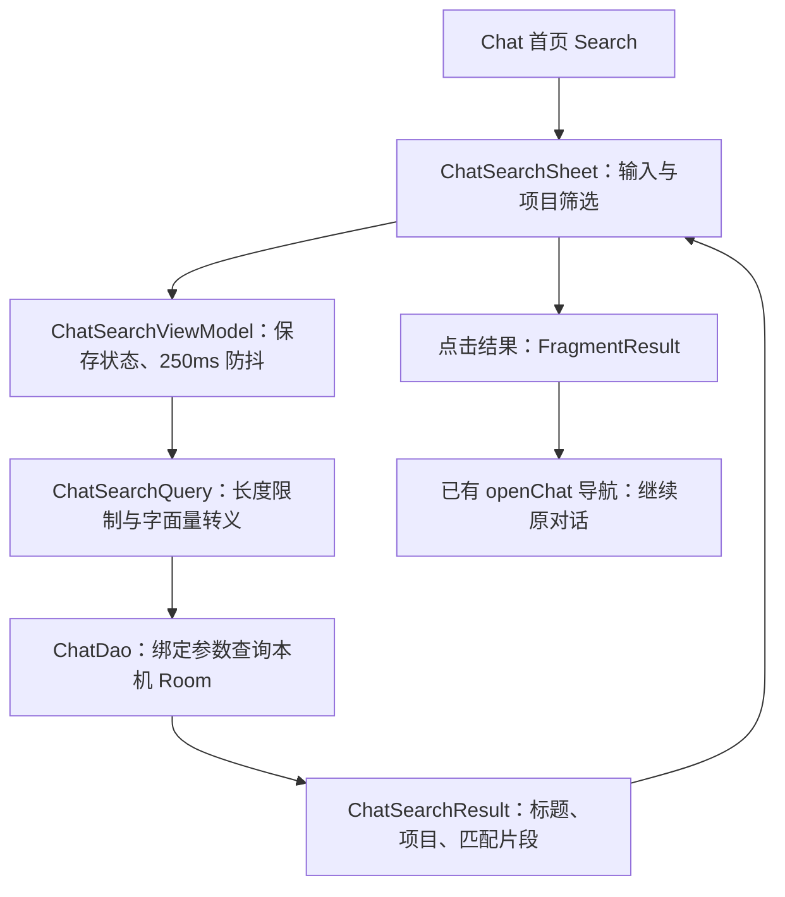
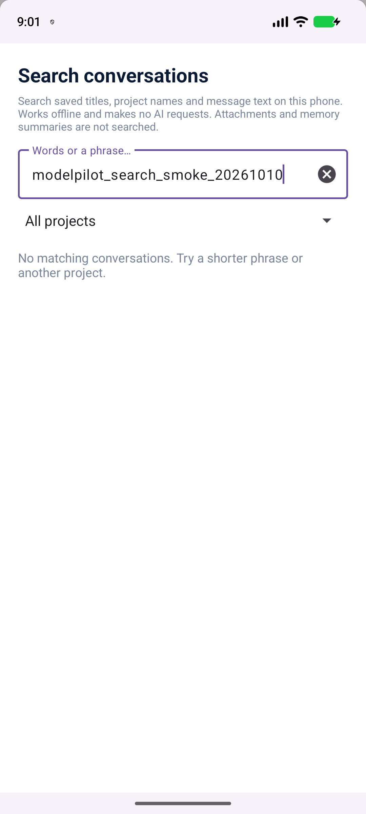

# 2026-10-10：离线聊天搜索

## 实际完成的功能

Chat 首页的 Search 按钮现在打开可用的搜索面板。用户输入关键词即可搜索本机保存的对话标题、项目名称及用户/助手消息；结果包含对话标题、所属项目和匹配片段，点击打开已有对话。支持全部项目、未归类对话或指定项目筛选。无需联网，不调用模型，也不产生 API 费用。

输入最多 160 字符，停止输入 250ms 后提交查询；最多显示 50 条，额外查询一条判断是否需要提示用户缩小范围。空查询显示操作提示，无结果显示空状态。旋转屏幕后保留查询与筛选状态。输入变化时清除旧结果，避免把过期结果当成当前结果。

## 与所选开源项目的关系

本项目选择的 Pydantic AI FastAPI chat 示例提供文本聊天、历史持久化及历史读取的基础。本次继续使用此前已适配的本机历史基础，增加 Android 原生搜索交互和 Room 查询。

**本次搜索代码是 ModelPilot 原创增强，不是从 Pydantic AI 复制的搜索模块。** 此前的历史桥接、导入/导出和流缓冲复用说明仍见 [PYDANTIC_REUSE.md](PYDANTIC_REUSE.md) 与 [OPEN_SOURCE_TECHNICAL_REPORT.md](OPEN_SOURCE_TECHNICAL_REPORT.md)。没有新增第三方库或伪称增加新的上游代码复用。

用户价值：在统一助手保存了许多任务后，可以重新找到某次 PDF 总结、翻译或项目讨论，直接进入原对话继续任务，减少重复提交内容的操作。搜索自身不发送历史给 Provider。

## 模块和数据流程



| 文件 | 本次职责 |
| --- | --- |
| `ChatSearchQuery.java` | 归一化关键词和项目范围；将 `%`、`_`、`!` 转为字面量搜索。 |
| `chat/local/ChatDao.java` | 搜索 SQL、LiveData 和同步验收接口；一条对话只返回一次，最近更新优先。 |
| `chat/local/ChatSearchResult.java` | 查询结果投影，避免加载整段对话到 UI。 |
| `ui/chat/ChatSearchViewModel.java` | SavedStateHandle、防抖与切换查询。 |
| `ui/chat/ChatSearchSheet.java` | 原生底部搜索面板、筛选、结果列表和空状态。 |
| `ui/chat/ChatHomeFragment.java` | 将原占位按钮接到搜索面板，复用现有对话导航。 |

实现片段：

```java
// SQL uses ESCAPE '!'; all inputs are bound parameters.
return "%" + text.replace("!", "!!")
                 .replace("%", "!%")
                 .replace("_", "!_") + "%";
```

SQL 对 USER/ASSISTANT 消息做匹配，用最新匹配消息生成最长 240 字符的片段。项目指令、SYSTEM/TOOL 消息不在搜索范围。查询以 chat 表为入口，删除对话后即使存在孤立消息，也不会展示该对话。无需数据库升级或修改 Provider API。

## 验证证据

| 验证 | 本次实际结果 |
| --- | --- |
| Android JVM 单元测试 | 323 项通过，0 failure/error；其中新增搜索查询测试 5 项。 |
| APK、lint、instrumentation APK 编译 | `:app:assembleDebug :app:lintDebug :app:assembleDebugAndroidTest` 成功。 |
| Pixel_6 模拟器真实 Room 验证 | AndroidJUnitRunner 实际输出 `OK (10 tests)`；这是执行结果，不只是编译测试 APK。 |
| 实际 UI 冒烟检查 | 首页搜索入口正常打开；输入后显示预期无匹配状态；旋转后保留查询；已恢复设备旋转设置。 |

10 项 Room 测试覆盖空查询、标题/正文去重、字面量特殊字符、注入式字符串、中文与 ASCII 大小写、项目/未归类隔离、长消息片段、内部角色排除、删除对话排除及确定性排序/结果上限。



截图来自真实 App 和模拟器，没有私密聊天内容。当前 UI 冒烟检查未包含点击非空结果和逐项操作项目筛选；这些应由组员继续做手动验收。此前 bridge 的 10 项 Python 测试和历史事务的 5 项设备测试属于 10-09 证据，本轮没有重新执行，不计为本轮新增测试。

复现命令（本机已配置 JDK/Android SDK）：

```powershell
./gradlew.bat :app:testDebugUnitTest :app:assembleDebug :app:lintDebug :app:assembleDebugAndroidTest --offline --console=plain
# Install current debug and androidTest APKs before this command:
adb shell am instrument -w -r -e class com.mobilegroup20.modelpilot.chat.ChatSearchDatabaseTest com.mobilegroup20.modelpilot.test/androidx.test.runner.AndroidJUnitRunner
```

## 挑战、边界和下一步

真实 Room 测试发现 SQLite 转义表达式问题，以及把 SQL 常量放在外部类时增量编译未刷新 DAO 实现的问题。最终使用 `!` 转义，并把 SQL 常量移入 DAO，重新生成实现后 10 项设备测试全部通过。这说明纯 Java 测试不能替代真实 SQLite 验证。

当前为 SQLite LIKE 子串搜索；结果限制和防抖减少 UI 开销，但不会消除大数据库的全表扫描。它不提供全文索引、模糊拼写、附件正文搜索或跳到精确消息；点击结果进入原对话。大小写行为以 SQLite 为准，不能宣称支持所有语言的 Unicode 大小写折叠。

搜索沿用当前主聊天的本机存储边界，不是论坛账号的云端历史搜索。下一步由组员验证非空结果点击、项目筛选、大字体/键盘/TalkBack，以及较大历史库的响应时间；只有测量发现需要时再引入 FTS。

本轮未改 report/PPT 版式，也未发出付费模型请求。实现由 Codex 协助，成员 review、学习和实际工时需由成员填写，不能把生成代码计为三人分别完成。
