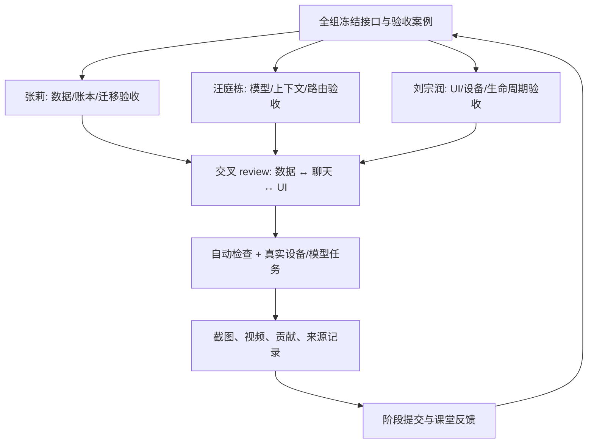

# ModelPilot：后续任务、接口协作与提交证据

2026-10-09；按现有 Outline 的课程 W4–W15 对照，实际当前周次、alpha/beta 日期尚需组内核对课程公告。本表不是所有历史功能已完成的声明。每人约 3 小时/周，总预算约 9 小时/周；优先验收主助手，再做增量。

## 第一批：下一次小组开发时完成

| 任务 | 建议 owner / reviewer | 明确操作与验收 | 证据 |
| --- | --- | --- | --- |
| A1 迁移链路 | Zhang Li / Wang Tingdong | 运行 bridge 的真实 SQLite 测试；复制样例到手机，预览、导入、追问、重复导入；验证旧 JSON/ZIP 无退化。 | 录屏 + 导入前后消息数、0 伪造 usage。 |
| A2 主聊天持久化 | Liu Zongrun / Zhang Li | Android Studio 启动模拟器，执行新增 5 项 ChatHistoryTransactionTest；删除聊天/回包竞态、跨项目隔离。 | 设备及 OS、Gradle 测试结果。 |
| A3 选模/上下文 | Wang Tingdong / Liu Zongrun | 两个实际可用模型，A–B–A 固定事实、项目指令编辑清空、压缩后保留；不依赖某个品牌名字永远可用。 | 脱敏路由理由和真实 Token/费用；失败情况也记录。 |
| A4 单条导出 UI | Liu Zongrun / Zhang Li | Chat 菜单导出；保存取消、旋转、文件名、重新导入；确认附件/账单省略提示易懂。 | 真实截图/录屏，禁止把设计稿当完成截图。 |
| A5 提交材料同步 | 全组；一人汇总、两人审核 | 修正 report 的主链路责任归属：主聊天/上下文/路由在本机，服务端负责账号/论坛；保留旧版式。 | 逐条内容差异和同版式 PDF 预览；本轮尚未自动改 Outline。 |

## 接口冻结和并行协作

共享接口：`CanonicalMessage`、`RenderedContext`、`TokenBundle`、`UsageCall`、`ChatHistorySnapshot` 和 `SendState`。聊天功能只能按实际 chatId 取历史；统计不能把 NDJSON 文本历史当账单；UI 不直接推断模型质量；Provider key 不放进 DTO、截图或报告。

一个分支一个可验收问题；更新 DAO/DTO 必须同时更新调用方和测试。不要一起修改 ChatConversationViewModel；数据接口由张莉 review、路由由汪庭栋 review、UI/生命周期由刘宗润 review。集成之前先 fetch，禁止 force push；未提交的队友修改不得覆盖。

## 对照 Outline 的课程阶段

| 周段/阶段 | 当前已有基础 | 剩余任务和完成门槛 |
| --- | --- | --- |
| W4–5 基础 | Chat/项目、Room、手机 Provider 链路已存在。 | 真实重启/离线/身份边界测试；记录本机与论坛账号不是自动同步的事实。 |
| W6–7 跨模型 | 双协议、Auto、记忆和项目指令已有代码与单测。 | A–B–A 真实任务、摘要纠正/重置、跨聊天隔离；解释 capacity/price/preference。 |
| W8–9 Alpha | 本机文本 PDF、账本已有。 | 先评估“预算硬拦截”的最小方案，再实施测试；不把存了预算等同于拦截。复杂工具循环先冻结，不阻塞主任务。 |
| W10–12 Beta | Insights、完整备份、NDJSON 迁移/导出已有。 | 导入重复、图表对账、未知字段、模型真实可用性；图像编辑仅在核心验收后评估。 |
| W13–14 稳定 | 论坛/新闻已有，与主聊天独立。 | 网络/旋转/删除/大字体/无障碍回归，修正报告和录屏。游戏已移出，不重新排入核心。 |
| W15 Final | 可构建 APK、来源证据、测试资料。 | 冻结代码/模型演示账户，最终 PDF/PPT/MP4/源码，三人分别解释模块和复用/原创。 |

具体日期不能从本文推断；组员填课程官方截止时间。若当前已进入后半阶段，则跳过已经验收的条目，优先补真实模型/设备证据，而非重做历史计划。

## 每人每周 3 小时的建议用法

约 15 分钟同步接口/上次反馈，75 分钟实现或修复，60 分钟复现与验收，30 分钟 review/证据整理。这个分配可以调整；AI 生成不免除测试、阅读和个人说明。复杂新增功能超预算就缩范围，保住统一助手闭环。

## 个人贡献与反馈台账（待真实填写）

| 实际日期 | 成员/出席情况 | issue / commit / PR | 实际工作及耗时 | 测试/截图 | AI 协助范围 | 下一步 |
| --- | --- | --- | --- | --- | --- | --- |
| 待填写 | 待填写 | 待填写 | 待填写 | 待填写 | 待填写 | 待填写 |

| 反馈日期/阶段 | 老师原话/出处 | 提出的问题 | 本组决定 | owner | 实现/验证链接 | 完成日期 |
| --- | --- | --- | --- | --- | --- | --- |
| 待确认 | 用户提供老师关于统一助手/日常任务的记录 | 不能只是编码用量仪表盘 | Chat 为主，非编码 PDF/文本任务，多模型共享上下文 | 全组 | 功能代码和真机案例待统一整理 | 待填写 |
| 2026-10-09 材料整理 | 用户提供 12 项评价要求 | 复用/新增关系和技术说明不够明确 | 模块来源映射、实际代码改编、用户价值、验证与分工证据 | 全组 | OPEN_SOURCE_TECHNICAL_REPORT.md | 本轮文档完成，组员验收待填写 |

## 提交检查

按老师模板的大标题和顺序；chosen source 附明确链接/许可；现有 vs 新增表；API/工具分开；完整和计划功能分开；每阶段测试与时间记录；真实设备截图/代码/流程图；视频中示范失败恢复；准确个人贡献。已有 PDF/PPT 的漂亮版式可保留，不能保留与当前实现冲突的技术叙述。
