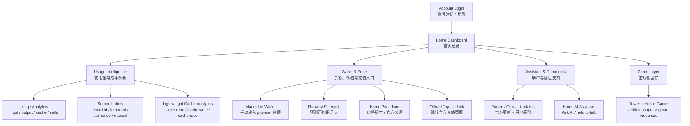

# TokenTrail 高分版 PPT 逐页设计方案

建议总页数：18 页。风格沿用现有 PPT：白底、深蓝绿主色、琥珀色强调、细线分隔、右侧手机界面/流程图。每页尽量做到“一页一个问题”，并加入老师要求的 diagram、screenshots、code snippet、similar app evidence、timeline。

---

## Slide 1 Cover

**Title**
TokenTrail

**Subtitle**
Mobile AI API usage, CNY cost and wallet runway tracker

**Small metadata**
Mobile App Project · Group 20 · Android / Java / XML / Room
Repository: github.com/LiuZongrun7/Mobile_Group_20

**Visual**
右侧放现有手机 mockup：`E:/Mobile_computing_project/tmp/tokentrail_slides_qa/slide-01.png` 可裁右侧手机图，或直接复用现有 slide 1 的右侧 phone visual。

**Speaker note**
TokenTrail focuses on pay-as-you-go AI API usage. It estimates cost from token records and dated prices, helps users manage manual balances, and uses a home assistant plus a game layer to improve retention.

---

## Slide 2 Guideline coverage map

**Title**
Project guideline coverage

**Main content table**
| Teacher requirement | Where this deck answers it |
|---|---|
| Brief app idea | Slides 3–4 |
| Similar apps and screenshots | Slides 5–6 |
| Open-source code to reuse | Slide 7 |
| Proposed features and uniqueness | Slides 8–13 |
| Diagrams, screenshots, code snippets | Slides 4, 8, 10, 12, 14–16 |
| Approach and work plan to week 15 | Slides 17–18 |

**Visual**
左侧表格，右侧小型 checklist。不要放太多正文。

---

## Slide 3 Problem and target users

**Title**
AI API spending is fragmented for student developers

**On-slide text**
Target users:
- Students and independent developers who use multiple AI APIs
- Small project teams testing OpenAI, MiMo, DeepSeek or similar providers
- Users who need RMB estimates rather than only USD/provider-console views

Pain points:
- Usage records sit in provider dashboards, local logs or coding-agent sessions
- API keys often cannot read full balance history
- Price changes make old estimates hard to reproduce
- Users cannot easily ask “why did this week cost more?” on mobile

**Visual**
A four-source fragmentation diagram:
Provider console, local logs, manual wallet, price pages → TokenTrail dashboard.

**Design note**
Use four small icons/labels on left, one phone mockup on right.

---

## Slide 4 App idea and scope boundary

**Title**
TokenTrail converts authorised usage records into mobile decisions

**Core sentence**
TokenTrail records or imports authorised pay-as-you-go AI API usage, estimates CNY cost using dated price records, forecasts wallet runway, and explains spending through a home-screen AI assistant.

**Scope table**
| Included | Excluded |
|---|---|
| Pay-as-you-go API usage | ChatGPT-style subscriptions |
| Imported or app-recorded usage | Hidden provider account history |
| Manual wallet balance | Direct payment processing |
| Official top-up links | Storing bank/payment information |
| Assistant answers from summaries | Controlling a coding agent |

**Flow diagram**
Login → Usage records → Price version → CNY cost → Manual wallet → Runway alert → Home price panel → Official top-up link

**Visual asset**
Use or redraw from report flow. Existing useful asset: `E:/Mobile_computing_project/Mobile_Group_20/docs/outline-slides-src/fig_flow.png`

---

## Slide 5 Similar apps: screenshots and what they solve

**Title**
Related products solve parts of the problem

**Content layout**
Use a 2x2 grid with screenshots or cropped webpage screenshots:

1. OpenAI Platform Usage Dashboard
   - Shows usage and export for one OpenAI organization/project
   - Limitation for us: not a mobile cross-provider tracker

2. Xiaomi MiMo API console
   - Provides model access and pay-as-you-go prices
   - Limitation: price/usage live in provider console

3. LiteLLM
   - Gateway with spend tracking and budgets for proxied traffic
   - Limitation: sees traffic only if routed through the proxy

4. AIUsage / dsh-context
   - Local usage parser or session/token visualizer
   - Limitation: desktop/local-tool focused, not a mobile wallet dashboard

**Screenshots to prepare**
- OpenAI Usage Dashboard: use official help page screenshot if available from `https://help.openai.com/en/articles/10478918-reviewing-api-usage-and-costs`
- OpenAI export dialog: official help page `https://help.openai.com/en/articles/20001072`
- LiteLLM homepage or docs: `https://www.litellm.ai/` or cost tracking docs
- AIUsage GitHub README screenshot: `https://github.com/juliantanx/aiusage`
- dsh-context GitHub README screenshot: `https://github.com/bowenliang123/dsh-context`

**Speaker note**
These screenshots are not shown as competitors to copy. They explain the existing landscape and identify the gap TokenTrail addresses.

---

## Slide 6 Gap analysis matrix

**Title**
The gap is mobile, RMB-based and evidence-labelled tracking

**Table**
| Product | Usage tokens | Cost/budget | Multi-provider | Mobile dashboard | Manual wallet | Game/retention |
|---|---:|---:|---:|---:|---:|---:|
| OpenAI dashboard | Yes | Yes | No | Partial | No | No |
| MiMo console | Partial | Price only | No | Partial | No | No |
| LiteLLM | Yes | Yes | Yes, proxied | Web/admin | No | No |
| AIUsage | Yes | Yes | Tool-specific | No | No | No |
| TokenTrail | Yes | Yes, CNY estimate | Recorded/imported providers | Yes | Yes | Yes |

**Key message box**
TokenTrail does not promise to read every hidden balance. It labels what is recorded, imported, estimated, manual or unavailable.

**Visual**
Use green check, amber partial, grey no. Keep it readable.

---

## Slide 7 Open-source code we can reuse

**Title**
Open-source usage trackers give us reusable parsers and cost models

**Main message**
This slide should not focus on Android libraries. It should show that the team studied real open-source AI usage trackers and can reuse their parsing ideas, data shapes, pricing logic and dashboard patterns with licence acknowledgement.

**Table**
| Project | Licence | Reusable code / design idea for TokenTrail |
|---|---|---|
| AIUsage by juliantanx | MIT | Local parser architecture, shared usage schema, pricing metadata, export flow, local database and dashboard separation. Useful for our import pipeline and source-label design. |
| dsh-context | Apache-2.0 | Session dashboard ideas for usage, cost, cache hit, daily activity, per-session context profile and estimated-vs-actual labels. Useful for our analytics screen and cache cards. |
| LiteLLM | MIT for the reusable OSS parts, with enterprise restrictions for some features | Spend log structure, model pricing map, per-key/user/team spend concepts, budget tracking vocabulary and zero-cost-warning idea. Useful for our price version and cost-estimation logic. |
| adylagad/ai-usage | MIT | Self-hosted dashboard that reads Claude Code JSONL, Codex CLI session JSONL, Copilot and Cursor sources. Useful reference for local log collectors and tool-specific import adapters. |

**What we will actually reuse**
- Data-model ideas: provider, model, token classes, cost, source, date range and local-cache status.
- Parser ideas: one adapter per source instead of one hard-coded importer.
- Cost logic ideas: estimate from saved pricing metadata and keep missing-price cases visible.
- Dashboard ideas: show usage, cost, cache and data coverage together.

**What we will not copy directly**
- Full web dashboards, admin panels or proxy servers.
- Enterprise-only LiteLLM features.
- UI artwork without licence confirmation.
- Any code copied without file-level attribution.

**Code snippet for the slide**
Use a short adapter-style pseudocode block rather than Android library code:

```java
interface UsageImporter {
    boolean supports(SourceFile file);
    List<UsageCall> parse(String uid, SourceFile file);
}

final class CodexJsonlImporter implements UsageImporter { ... }
final class DshSessionImporter implements UsageImporter { ... }
final class ManualCsvImporter implements UsageImporter { ... }
```

**Visual**
A reuse map:
AIUsage parsers + dsh-context cache/session UI + LiteLLM spend/pricing ideas + ai-usage collectors -> TokenTrail Android import and analytics layer.

**Speaker note**
The project will reuse concepts and small compatible code patterns only when the licence allows it. Every copied file or adapted algorithm should be listed in the final documentation with source URL, version and licence.
---

## Slide 8 Final feature structure

**Title**
Final feature structure

**Main message**
Do not use a simple horizontal journey diagram on this slide. Use a structured feature map that shows Home Dashboard as the centre of the product. This makes the app look like a coherent system rather than a long list of unrelated functions.

**Structured flowchart**



**Right-side explanation box**
- The app starts from login and opens into the Home Dashboard.
- The dashboard connects four feature groups: usage intelligence, wallet and price, assistant/community, and game layer.
- Every supporting feature links back to recorded API usage, estimated CNY cost or user retention.

**Bottom emphasis line**
Core logic: usage records -> CNY cost -> wallet runway -> price/top-up action -> assistant explanation -> game reward

**Design note**
Use a top-down structure. Put Login and Home at the top, four grouped modules in the middle, and detailed functions at the bottom. Use deep blue for Home, teal for usage, amber for wallet/price, light blue for assistant/community and light green for game. Keep labels short so the slide remains readable.
---

## Slide 9 Feature detail: dashboard and usage analytics

**Title**
Dashboard shows what happened and what data is missing

**On-slide text**
Dashboard cards:
- Monthly tokens and estimated CNY spending
- Budget progress and remaining runway
- Provider/model breakdown
- Missing records and unavailable fields

Usage analytics:
- Input token, output token, cache read, cache write
- Calls, provider, model, timestamp and price version
- Daily, weekly and monthly summaries

**Visual**
Phone mockup with Home dashboard. Use existing report UI sketch or create one from current slide 1/3 assets.

**Chart idea**
Small stacked bar: input, cache read, cache write, output.

---

## Slide 10 Feature detail: cache and cost calculation

**Title**
Cache fields stay separate because they price differently

**Explanation text**
TokenTrail stores four token classes:
- Input token: normal prompt tokens
- Output token: model response tokens
- Cache read: cached context reused by the provider
- Cache write: context written into cache for later reuse

Cache analysis stays lightweight. It shows totals and a simple cache ratio inside usage analytics instead of becoming a separate complex module.

**Code snippet**
Use `TokenBundle.java`:

```java
public class TokenBundle {
    public long input;
    public long cacheRead;
    public long cacheWrite;
    public long output;

    public long total() {
        return input + cacheRead + cacheWrite + output;
    }
}
```

**Visual**
Stacked bar with four colors. Add small label: “Cache read and cache write are not merged.”

---

## Slide 11 Feature detail: manual wallet and runway forecast

**Title**
Manual wallet makes balance tracking feasible without hidden APIs

**On-slide text**
Why manual wallet:
- Many provider API keys cannot read account balance directly
- Users can enter balances such as MiMo ¥5 or DeepSeek ¥20
- TokenTrail subtracts estimated spending from imported/recorded usage

Runway formula:
Recent daily average cost = last N days cost / N
Estimated runway = remaining balance / recent daily average cost

Example:
Balance ¥20, average daily spend ¥2 → about 10 days remaining

**Visual**
A wallet card mockup:
Provider: Xiaomi MiMo
Manual balance: ¥5.00
Estimated spend: ¥1.20
Runway: 3.2 days
Status: Low soon

---

## Slide 12 Feature detail: Home price icon and top-up panel

**Title**
Price and top-up information stay close to the dashboard

**On-slide text**
The Home price icon opens a lightweight panel with:
- Provider and model prices
- Input, output and cache price fields
- Currency and effective date
- Official source link
- Official billing/top-up link

The app never processes payment. It opens official provider pages through browser intent.

**Visual diagram**
Home dashboard → tap price icon → price panel → official billing page

**Code/UI snippet suggestion**
Show a pseudo-snippet:

```java
Intent intent = new Intent(Intent.ACTION_VIEW, Uri.parse(provider.topUpUrl));
startActivity(intent);
```

**Design note**
This slide should make clear that Price Center is not a separate tab. It is a Home panel.

---

## Slide 13 Feature detail: Forum and official updates

**Title**
Forum separates official updates from user tips

**On-slide text**
Two information types:
- Official updates: model release, price change, API update, billing link
- Community posts: usage tips, cache examples, cost-saving experience

Design rule:
Community posts never replace official price sources. Price estimates use saved price records with source URLs and effective dates.

**Visual**
Two-column feed:
Official update card on left, community tip card on right.

**Demo story**
A provider price changes. TokenTrail stores the new price version, then future estimates use the new rate while old records keep their historical rate.

---

## Slide 14 Feature detail: Home AI assistant

**Title**
The assistant answers from app evidence

**On-slide text**
User asks:
“Why did this week cost more?”

Assistant reads only:
- Usage summaries
- Wallet and runway summaries
- Price versions
- Cache totals
- Forum highlights

Answer includes:
- Main reason
- Data coverage and missing records
- Price version used
- Separate assistant API cost

**Code snippet**
Use read-only tool names from report:

```java
getUsageSummary(uid, range)
getWalletRunway(uid)
getPriceVersions(provider, model)
getForumHighlights(provider)
getMyThreads(uid)
```

**Visual**
Phone mockup conversation. Current slide 10 already has a good mockup.

---

## Slide 15 Feature detail: tower-defence game

**Title**
Verified usage becomes game resources without changing finance data

**On-slide text**
Resource rule:
- Imported and verified usage can become monthly game resources
- Sample data does not count
- Re-importing the same record gives no duplicate resources
- Game actions never change real usage, budget or wallet balance

Game loop:
Usage record → settlement → resource balance → build tower/wall → start wave → monthly reset

**Code snippet**
Use `Cost.java`:

```java
public boolean affordable(ResourceBalance balance) {
    for (ResourceType resource : ResourceType.values()) {
        if (balance.get(resource) < amounts[resource.ordinal()]) {
            return false;
        }
    }
    return true;
}
```

**Visual**
Use existing game phone mockup from slide 9.

---

## Slide 16 System architecture

**Title**
Architecture separates UI, records, advice and game state

**Diagram**
Android UI layer:
Login, Home, Usage, Forum, Game, Profile

Repository layer:
UsageRepository, BudgetRepository, ForumRepository, SeasonRepository, AdviceRepository

Data layer:
Room database, pricing source, importers, server sync

External layer:
Provider docs/API records, official billing links, model API for assistant

**Suggested diagram layout**
Four stacked layers. Draw arrows downward for data writes and upward for summaries.

**Code evidence**
Mention existing packages:
- `contract/model`
- `data/local`
- `data/repository`
- `game/engine`
- `ui/dashboard`, `ui/forum`, `ui/game`

---

## Slide 17 Database and data flow

**Title**
The database keeps raw records and derived summaries separate

**ER/data model blocks**
User
- uid, email, display name, settings

UsageCall
- uid, provider, model, timestamp, input, cacheRead, cacheWrite, output, source, cost fields

DailyUsage
- uid, day, provider, model, calls, token totals, estimated cost

PricingRate
- provider, model, token class, price, currency, effective date, source URL

WalletBalance
- uid, provider, manual balance, currency, updated time

SeasonState
- uid, month, resource balance, towers, wave state

ForumPost
- uid, source type, provider, title, content, link, timestamp

**Flow**
Raw records → de-duplication → daily rollup → dashboard / assistant / wallet / game settlement

**Code snippet**
Use `DailyRollup.java` concept:

```java
String key = day + provider + model;
row.calls++;
row.input += call.input;
row.cacheRead += call.cacheRead;
row.cacheWrite += call.cacheWrite;
row.output += call.output;
```

---

## Slide 18 Timeline and team plan

**Title**
Work plan to week 15

**Timeline table**
| Weeks | Work | Acceptance evidence |
|---|---|---|
| 1–3 | Verify usage fields, prices, import formats and UI scope | Source links, sample data, report/PPT |
| 4–7 | Build login, Room database, import, dated pricing, dashboard | Stored records, CNY estimates, screenshots |
| 8–9 Alpha | Login → import → dashboard → wallet → price panel | APK/video, GitHub commits, core demo |
| 10–12 Beta | Assistant, forum, game settlement and chart polish | Assistant evidence, posts, playable wave |
| 13–15 Final | Testing, accessibility, speed, documentation and video | Stable demo, code snippets, final report/PPT |

**Team split**
- Zhang Li: account, usage storage, pricing, dashboard, query interfaces
- Wang Tingdong: AI assistant, voice/text panel, forum, official updates
- Liu Zongrun: tower-defence engine, UI, settlement, game testing

**Closing statement**
The final demo will show one continuous path: login → recorded usage → CNY cost → wallet runway → price/top-up panel → evidence-based assistant → game resources.

---

# Recommended local assets already available

1. Existing rendered deck screenshots:
   - `E:/Mobile_computing_project/tmp/tokentrail_slides_qa/slide-01.png`
   - `E:/Mobile_computing_project/tmp/tokentrail_slides_qa/slide-09.png`
   - `E:/Mobile_computing_project/tmp/tokentrail_slides_qa/slide-10.png`

2. Existing diagram assets:
   - `E:/Mobile_computing_project/Mobile_Group_20/docs/outline-slides-src/fig_flow.png`
   - `E:/Mobile_computing_project/Mobile_Group_20/docs/outline-slides-src/fig_ui.png`
   - `E:/Mobile_computing_project/Mobile_Group_20/docs/outline-slides-src/fig_game.png`
   - `E:/Mobile_computing_project/Mobile_Group_20/docs/outline-slides-src/fig_agent.png`

3. Code snippet source files:
   - `E:/Mobile_computing_project/Mobile_Group_20/app/src/main/java/com/mobilegroup20/tokentrail/contract/model/TokenBundle.java`
   - `E:/Mobile_computing_project/Mobile_Group_20/app/src/main/java/com/mobilegroup20/tokentrail/contract/model/UsageCall.java`
   - `E:/Mobile_computing_project/Mobile_Group_20/app/src/main/java/com/mobilegroup20/tokentrail/data/local/AppDatabase.java`
   - `E:/Mobile_computing_project/Mobile_Group_20/app/src/main/java/com/mobilegroup20/tokentrail/data/local/DailyRollup.java`
   - `E:/Mobile_computing_project/Mobile_Group_20/app/src/main/java/com/mobilegroup20/tokentrail/game/engine/Cost.java`

# Similar-app evidence sources for PPT notes

- OpenAI Help Center: Reviewing API usage and costs, `https://help.openai.com/en/articles/10478918-reviewing-api-usage-and-costs`
- OpenAI Help Center: Exporting monthly usage details, `https://help.openai.com/en/articles/20001072`
- LiteLLM cost tracking docs, `https://github.com/BerriAI/litellm-docs/blob/main/docs/proxy/cost_tracking.md`
- LiteLLM homepage, `https://www.litellm.ai/`
- AIUsage GitHub, `https://github.com/juliantanx/aiusage`
- adylagad/ai-usage GitHub, `https://github.com/adylagad/ai-usage`
- dsh-context GitHub, `https://github.com/bowenliang123/dsh-context`


