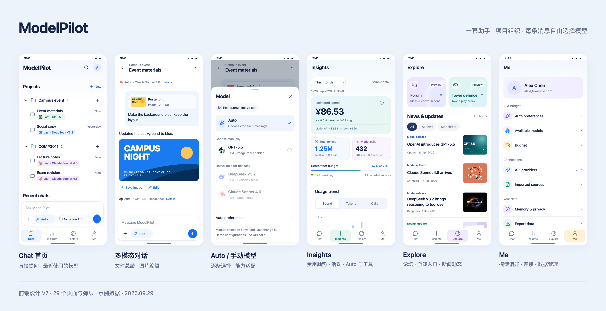

# ModelPilot 前端设计稿

V7 静态设计稿：29 张主设计图、13 张补充长图 / 状态图，以及页面与交互说明。界面为英文，说明为中文。

这里没有 HTML、CSS、JavaScript、依赖包或截图脚本。在 GitHub 上直接查看图片与 Markdown 即可，不需要启动服务。图中的回答、模型配置、用量和费用为设计示例，不表示功能已经接通。

## 浏览入口

- [完整图册](GALLERY.md)：按 Chat / Insights / Explore / Me 浏览 29 张主图。
- [设计说明](DESIGN.md)：页面结构、Auto / 手动选择、上下文管理和视觉规范。
- [Insights 说明](INSIGHTS.md)：统计口径与 Android 接入建议。
- [素材来源](SOURCES.md)：图中品牌标志与新闻配图出处。
- [配套 Outline](../modelpilot-outline/README.md)：PDF 与 LaTeX 源文件。

## 主设计图

| 编号 | 模块 | 页面 |
| --- | --- | --- |
| 01 | Chat | [Chat 首页](screens/01-home.png) |
| 02 | Chat | [项目详情](screens/02-project.png) |
| 03 | Chat | [多模态对话](screens/03-conversation.png) |
| 04 | Chat | [模型选择](screens/04-models.png) |
| 05 | Chat | [选择项目](screens/05-project-select.png) |
| 06 | Chat | [新建项目](screens/06-new-project.png) |
| 07 | Chat | [添加附件](screens/07-attachments.png) |
| 08 | Chat | [回复明细](screens/08-reply-details.png) |
| 09 | Chat | [对话记忆](screens/09-memory.png) |
| 10 | Chat | [搜索](screens/10-search.png) |
| 11 | Chat | [图片结果](screens/11-image.png) |
| 12 | Chat | [空白与异常状态](screens/12-states.png) |
| 13 | Insights | [用量首页](screens/13-insights.png) |
| 14 | Insights | [调用记录](screens/14-usage.png) |
| 15 | Insights | [预算](screens/15-budget.png) |
| 16 | Insights | [价格中心](screens/16-pricing.png) |
| 17 | Explore | [Explore](screens/17-explore.png) |
| 18 | Explore | [社区](screens/18-community.png) |
| 19 | Explore | [帖子详情](screens/19-post.png) |
| 20 | Explore | [TokenDefend](screens/20-game.png) |
| 21 | Explore | [产品更新](screens/21-updates.png) |
| 22 | Me | [个人与设置](screens/22-me.png) |
| 23 | Me | [Auto 偏好](screens/23-preferences.png) |
| 24 | Me | [可用模型](screens/24-available-models.png) |
| 25 | Me | [API 连接](screens/25-providers.png) |
| 26 | Me | [外部用量](screens/26-sources.png) |
| 27 | Me | [数据与记忆](screens/27-privacy.png) |
| 28 | Me | [导出数据](screens/28-export.png) |
| 29 | Me | [帮助与关于](screens/29-help.png) |

## 补充图

| 内容 | 图片 |
| --- | --- |
| Chat 首页长图 | [查看设计图](screens/01-home-full.png) |
| 完整对话长图 | [查看设计图](screens/03-conversation-full.png) |
| 对话中的图片编辑结果 | [查看设计图](screens/03-conversation-image-result.png) |
| 任务处理中 | [查看设计图](screens/12-state-working.png) |
| 失败与重试 | [查看设计图](screens/12-state-error.png) |
| 预算不足 | [查看设计图](screens/12-state-budget.png) |
| Insights 完整长图 | [查看设计图](screens/13-insights-full.png) |
| Insights 趋势与分布 | [查看设计图](screens/13-insights-trends.png) |
| Insights 活动日历 | [查看设计图](screens/13-insights-activity.png) |
| Insights Auto 与工具统计 | [查看设计图](screens/13-insights-routing.png) |
| Insights 无数据状态 | [查看设计图](screens/13-insights-empty.png) |
| Explore 完整长图 | [查看设计图](screens/17-explore-full.png) |
| Explore 新闻详情 | [查看设计图](screens/17-explore-news-detail.png) |

长图用于展示滚动后的完整内容，不代表实际手机屏幕高度。静态图册不会执行发送消息、模型切换、文件上传等操作；实现时按设计说明还原这些流程。
